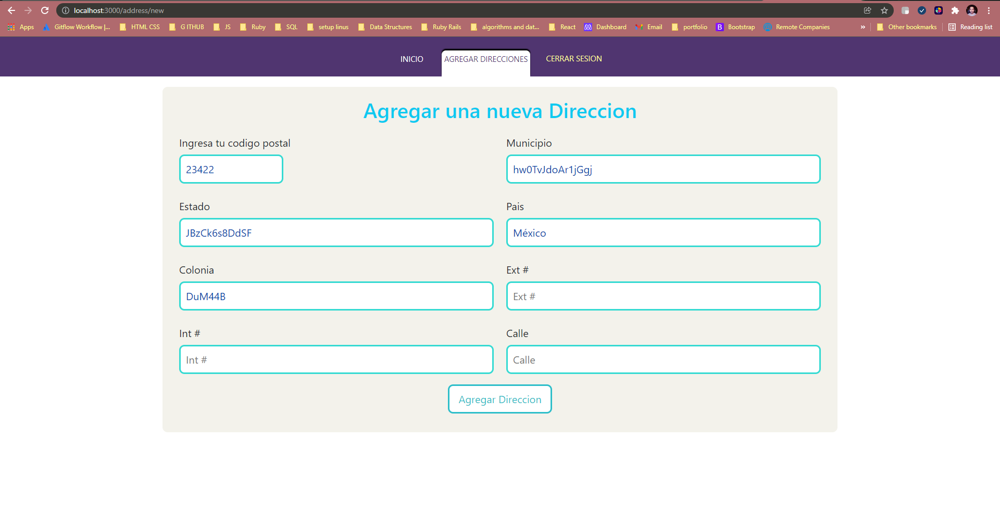
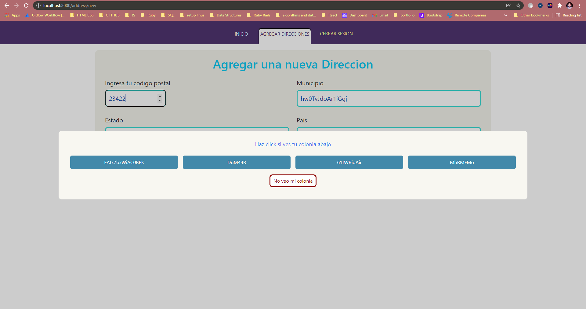
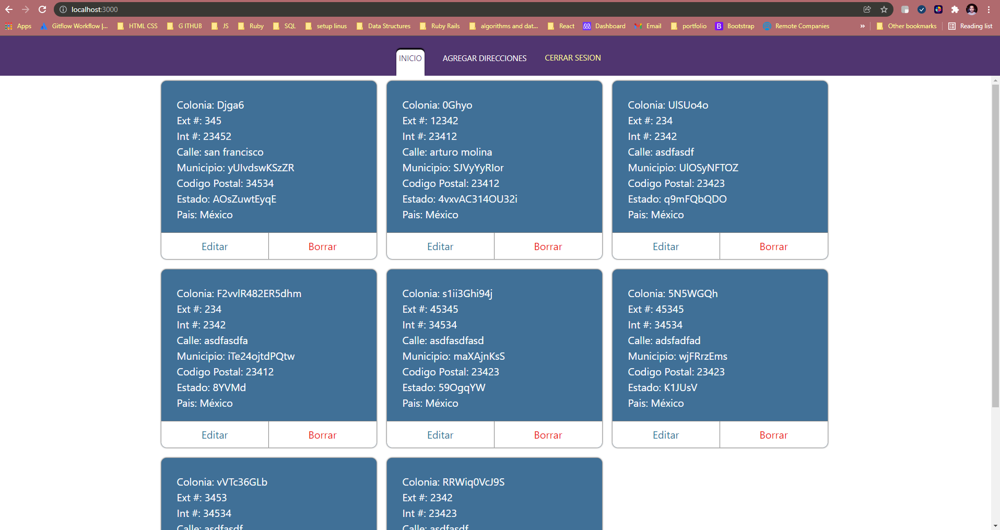
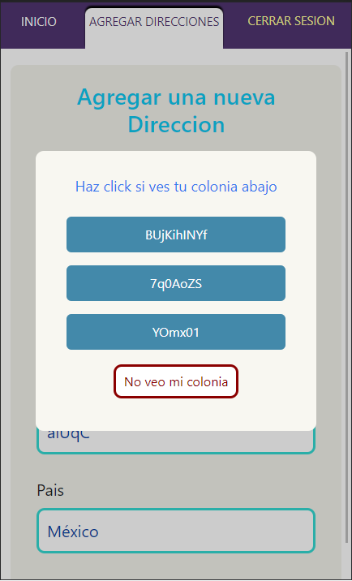
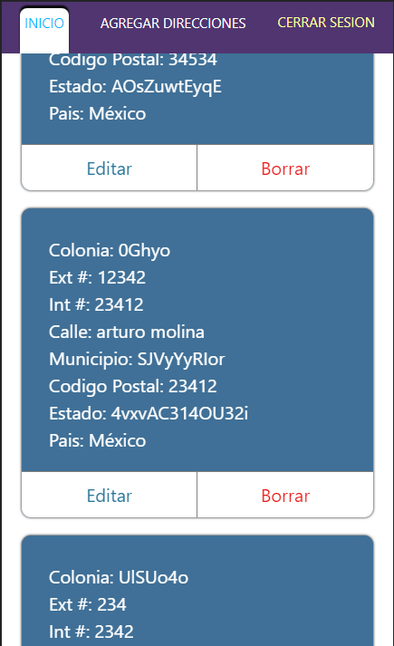
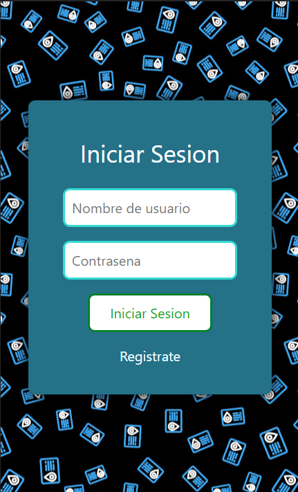

# Easy Address Page

This is a project made to store addresses from mexico. It display the list of addresses stored and allows you to create, update and delete addresses. Addresses are verify by the [COPOMEX](https://api.copomex.com/) api service that helps to identify addresses.

Page es completely responsive so it works with phones, tablets or desktop apps.

     

## Backend

This proejct backend was done with rails, and the repository link is on [link](https://github.com/JAAR91/easy-address)

This project was bootstrapped with [Create React App](https://github.com/facebook/create-react-app).

## Available Scripts

In the project directory, you can run:

### `npm start`

Runs the app in the development mode.\
Open [http://localhost:3000](http://localhost:3000) to view it in your browser.

The page will reload when you make changes.\
You may also see any lint errors in the console.

### `npm test`

Launches the test runner in the interactive watch mode.\
See the section about [running tests](https://facebook.github.io/create-react-app/docs/running-tests) for more information.

### `npm run build`

Builds the app for production to the `build` folder.\
It correctly bundles React in production mode and optimizes the build for the best performance.

The build is minified and the filenames include the hashes.\
Your app is ready to be deployed!

See the section about [deployment](https://facebook.github.io/create-react-app/docs/deployment) for more information.

### `npm run eject`

**Note: this is a one-way operation. Once you `eject`, you can't go back!**

If you aren't satisfied with the build tool and configuration choices, you can `eject` at any time. This command will remove the single build dependency from your project.

Instead, it will copy all the configuration files and the transitive dependencies (webpack, Babel, ESLint, etc) right into your project so you have full control over them. All of the commands except `eject` will still work, but they will point to the copied scripts so you can tweak them. At this point you're on your own.

You don't have to ever use `eject`. The curated feature set is suitable for small and middle deployments, and you shouldn't feel obligated to use this feature. However we understand that this tool wouldn't be useful if you couldn't customize it when you are ready for it.

## Learn More

You can learn more in the [Create React App documentation](https://facebook.github.io/create-react-app/docs/getting-started).

To learn React, check out the [React documentation](https://reactjs.org/).

### Code Splitting

This section has moved here: [https://facebook.github.io/create-react-app/docs/code-splitting](https://facebook.github.io/create-react-app/docs/code-splitting)

### Analyzing the Bundle Size

This section has moved here: [https://facebook.github.io/create-react-app/docs/analyzing-the-bundle-size](https://facebook.github.io/create-react-app/docs/analyzing-the-bundle-size)

### Making a Progressive Web App

This section has moved here: [https://facebook.github.io/create-react-app/docs/making-a-progressive-web-app](https://facebook.github.io/create-react-app/docs/making-a-progressive-web-app)

### Advanced Configuration

This section has moved here: [https://facebook.github.io/create-react-app/docs/advanced-configuration](https://facebook.github.io/create-react-app/docs/advanced-configuration)

### Deployment

This section has moved here: [https://facebook.github.io/create-react-app/docs/deployment](https://facebook.github.io/create-react-app/docs/deployment)

### `npm run build` fails to minify

This section has moved here: [https://facebook.github.io/create-react-app/docs/troubleshooting#npm-run-build-fails-to-minify](https://facebook.github.io/create-react-app/docs/troubleshooting#npm-run-build-fails-to-minify)

## Usage
This project requires the usage of a .env.local file to run locally, so make sure you create the file and enter the following information:
```
REACT_APP_COPOMEX_API_KEY="https://api.copomex.com/query/info_cp/"
REACT_APP_COPOMEX_API_TOKEN="prueba"
REACT_APP_EASY_ADDRESS_NEW_USER_API="https://jaar-easy-address.herokuapp.com/api/v1/user/new"
REACT_APP_EASY_ADDRESS_LOGIN_API="https://jaar-easy-address.herokuapp.com/api/v1/login"
REACT_APP_EASY_ADDRESS_ADDRESS_LIST_API="https://jaar-easy-address.herokuapp.com/api/v1/address"
REACT_APP_EASY_ADDRESS_ADDRESS_NEW_API="https://jaar-easy-address.herokuapp.com/api/v1/address/new"
REACT_APP_EASY_ADDRESS_ADDRESS_UPDATE_API="https://jaar-easy-address.herokuapp.com/api/v1/address/update/"
REACT_APP_EASY_ADDRESS_ADDRESS_DELETE_API="https://jaar-easy-address.herokuapp.com/api/v1/address/delete/"
```

If you want to user the SEPOMEX service, you have to create and account with them, you will get api token on your email, and replace it with the word prueba. To use it locally you change all  the herou links for one like this:
```
localhost:3000/api/v1 
```
Remember to add the full link following the information of the backend [here](https://github.com/JAAR91/easy-address).

👨‍💻 **Jose Alberto Arriaga Ramos**

- GitHub: [@jaarkira](https://github.com/jaarkira )
- Twitter: [@91_jaar](https://twitter.com/91_jaar )
- LinkedIn: [Jose Arriaga](https://www.linkedin.com/in/jaar/)


## 🤝 Contributing

Contributions, issues, and feature requests are welcome!

Feel free to check the [issues page](https://github.com/DanSam5K/Webflix-Index/issues).

## Show your support

Give a ⭐️ if you like this project!


## Acknowledgments

- Hat tip to anyone whose code was used 🔰
- Inspiration 💘
- Microverse program ⚡
- Our standup team 🏹
- Our family's support 🙌

## 📝 License

This project is [MIT](./LICENSE) licensed.
